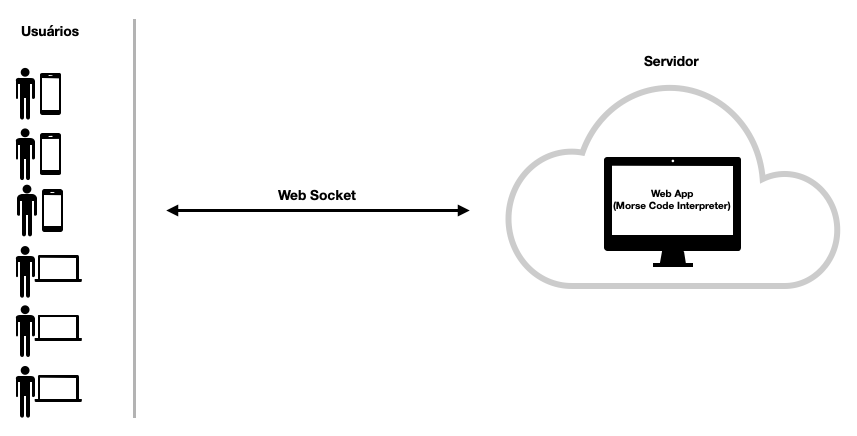

# Morse Code Interpreter


## Descrição

Este projeto tem o intuíto de atuar como uma pequena aplicação web, que possibilitará a seu usuário traduzir **código morse** para texto e vice-versa.


## Funcionamento

A idéia básica por traz do funcionamento de nossa aplicação, é que o usuário possa se conectar a um servidor via web socket e iniciar um processo de comunicação, onde ele enviará dados (mensagens) ao servidor e este, em tempo real, traduzirá e retornará a tradução do conteúdo ao usuário.


## Tecnologias empregadas

Para o desenvolvimento de nossa aplicação tomamos como base as seguintes tecnologias:

* Backend: Python
* Frontend: HTML5, CSS e JS

Durante o processo de desenvolvimento, foram utilizadas algumas libs de apoio, tanto no Frontend quanto no Backend, para facilitar sua implementação.
As principais libs utilizadas foram:

* Frontend:
  * [Bootstrap](https://getbootstrap.com/)
  * [Socket.io](https://socket.io/)
* Backend:
  * [Flask](https://flask.palletsprojects.com/en/2.0.x/)
  * [Gunicorn](https://gunicorn.org/)
  * [Flask-SocketIO](https://github.com/miguelgrinberg/Flask-SocketIO)
  * [Simple-WebSocket](https://pypi.org/project/simple-websocket/)


## Fluxo de funcionamento




## Arquitetura inicial

Por se tratar de uma aplicação muito simples (apenas um Frontend que conversa com um Backend, e não armazena dados), e por não requerer grandes recursos computacionais, optamos por uma arquitetura igualmente simplificado, onde nossa aplicação possui todo o bloco de código (Frontend e Backend) em um único artefato.

Para este artefato utilizaremos um container ([Docker](https://www.docker.com/)), pois este poderá alocar/concentrar todos os recursos necessários (SO, código fonte, etc) em um único ponto.

Esta forma de empacotamento se faz muito eficaz, pois podemos transportar nossa aplicação para ser executada nos mais variados SO (Windows, Linux, MacOS, etc), sem que seja necessário a mudança de código, libs ou outros itens.

Basta termos o Docker instalado, clonamos o projeto, executar os comandos docker adequados, e temos a aplicação no ar.

**Obs** O descritivo acima não considera tarefas adjacentes a implantação tais como configuração de DNS, Proxy Reverso, Firewall ou quaisquer outros meios necessários para colocar uma aplicação funcionando em sua infraestrutura.
## Arquitetura ideal

Não existe um padrão de arquitetura que resolva todos os problemas de todas as aplicações. Cada caso é um caso particular que deve ser estudado com atenção e cuidados.

Para nosso exemplo acima, por se tratar de uma aplicação web simple que nem banco de dados utiliza, podemos sugerir alguns modelos que atenderiam as necessidades de escalar a aplicação para grandes quantidades de usuários, que por sua vez, se traduz em elevado número de acessos.

Segue abaixo modelo sugerido, visando simplificar o processo:


### Nuvem AWS:

Supondo que nossa aplicação foi instalada em um servidor **EC2** (Elastic Compute Cloud) da Amazon Web Server (AWS), poderíamos nos valer de um escalonamento horizontal (criação de servidores em paralelo, e preferencialmente em zonas diferentes para garantir disponibilidade), com a utilização do serviço **Auto Scaling**.

Este serviço utiliza-se do **Cloud Watch** (outro serviço da AWS) para monitorar um servidor específico (ou pull de servidores). Com base em métricas definidas, quando um valor X é atingido, ele envia uma notificação via **SNS** (outro serviço da AWS) para o serviço EC2, afim de que este último crie e instancie um novo servidor, e o introduza em nosso pull de recursos, com isso garantindo completo atendimento aos nossos usuários.

Para complementar, da mesma forma que o **Auto Scaling** é utilizado para aumentar nossos recursos, também pode ser utilizado para diminuí-los.


## Pré-Requisitos

* Git
* Docker

## Execução

Como o projeto foi desenvolvido e preparado para container (Docker), não será preciso várias ferramentas, linguagens, bibliotecas e compiladores. Para executa-lô, basta seguir os passos abaixo:

1) Clonar o repositório em sua máquina
```
git clone git@github.com:alessdr/morsecode.git
```

2) Criar a imagem docker com o código clonado
```
docker build -t morse . 
```

3) Criar/executar o container 
```
docker run -d --rm --name morse -p 5000:5000 morse
```

4) Abrir o browser e acessar o endereço abaixo
```
http://127.0.0.1:5000
```

## Considerações finais

O tempo para desenvolvimento desta aplicação foi curto (cerca de 1 dia e meio)

Por este motivo não foi possível implementar todas as funcionalidades e arquitetura desejadas.

Uma versão futura poderia conter os seguintes recursos/elementos:

* Autenticação (Via serviço externo ou com a utilização do próprio Flask, via lib Flask-Login).
* Implementação de log de acessos.
* Caso a implantação fosse feita na AWS:
  * Poderiamos colocar nosso código via **Lambda**, e com isso não nos preocuparmos mais com escalonamento, pois este serviço já faz o gerenciamento de toda a infraestrutura de execução de nosso código.
  * No caso de utilização de bancos, poderiamos utilizar o servico **RDS** (Relational Database Service).
  * Caso não optemos pelo Lambda, poderiamos utilizar o **EC2** e o serviço de **Auto-scaling**
* Caso venhamos a armazenar dados em uma base, e esta vier a crescer muito, poderíamos implementar réplicas de leitura para acelerar os acessoas aos bancos.
* Implementar alguma ferramenta de monitoria tipo o [New Relic](https://newrelic.com/), com utilização de monitoramento ativo e passivo e envio de relatórios para os responsáveis via e-mail/celular.
* Implementação de CI/CD para nosso fluxo de desenvolvimento.

## Ainda em tempo

a) Uma versão instalada e funcional da aplicação, pode ser vista na url abaixo, deployada no [Heroku](https://www.heroku.com/).

```
https://morse-code-interpreter.herokuapp.com/
```

**Obs:** Por favor, seja paciente ao executa-la, pois se trata de uma conta free e a máquina demora um pouco a subir na 1a execução.

b) O arquivo **.env** só se encontra no repositório da aplicação, pois esta é apenas para fins didáticos. Nunca versione este arquivo.
